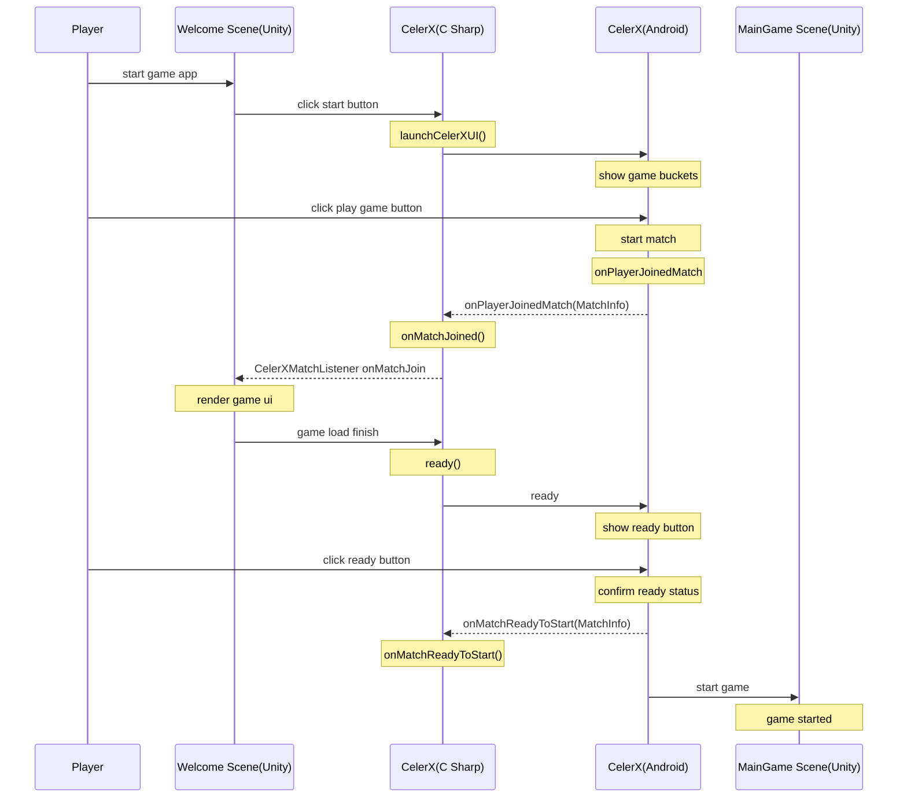

# CelerX Unity SDK Android Demo: Rocket Rider

This repo is a Unity project which integrate CelerX game SDK with export to Android.

## Install Unity

Unity Version: 2019.3.6f1

Install Unity Modules In Unity Hub:

Unity Hub -> Install-> Add Modules -> Android Build Support(With Android SDK & NDK and open JDK) -> iOS Build Support


## Tools

- Unity (game engine)
- Visual Studio (IDE)
- C# (logic)
- optional: Android Studio

## Import CelerX Android Plugin

<b>The plugin is used to generate Android project without additional Android coding work. </b>

There are two parts:

1. Copy these Android-related files into Unity assets folder Assets/Plugins/Android

- AndroidManifest.xml
- build.gradle
- launcherBuild.gradle
- unityLibraryBuild.gradle

2. Import CelerX Editor Script

<https://github.com/celerx/unity-sdk-android-demo/tree/master/Assets/CelerX>

```
.
├── Assets
|   └── CelerX       - Generate Android project with CelerX SDK
|       └── Editor   - CelerX C# APIs  

```

## Integrate CelerX APIs (C#)

<b>launchCelerXUI()</b>

Give a welcome scene in your game. Call launchCelerXUI API in welcome scene script while start game button be triggered.

<b>onPlayerJoinedMatch(MatchInfo mathInfo)</b>

This callback will be run after the player has been matched from CelerX server.
Developers can get any match informations from parameter `MatchInfo` , such as players' information and sharedRandomSeed. Developers should do UI rendering in this function body.

<b>ready()</b>

If game has been loaded and game rendering was finished, developers must call ready function to confirm game can be start, then CelerX will show a ready button in match view for player.

```
public void onPlayerJoinedMatch(MatchInfo matchInfo) {

        //render game scene with match information
        renderGameScene(matchInfo);

        // notify celerx
        celerX.ready();
    }
```

<b>onMatchReadyToStart(MatchInfo matchInfo)</b>

This method will be called when "Ready" button has been clicked and CelerX has confirmed that everything is ready, It indicates that game can start now. Users will see your game scene here. Put your game start logics here.

<b>submitScore()</b>

When the game is over, call this API to submit final score to CelerX platform

## Sequence Diagram



## Run your Game on Android device

Unity, File -> Build and Run

> Unity has interated gradle plugin for exporting Android apk, just make sure Android Support has beed installed in your Unity Hub.

For further modification or customization of your Android project, you can export Android project folder with File -> Build settings -> Android -> Export , then import project with [Android Studio](https://developer.android.com/studio?gclid=EAIaIQobChMIyrLd5bvB6AIVCayWCh3__w-8EAAYASAAEgL7afD_BwE&gclsrc=aw.ds)


