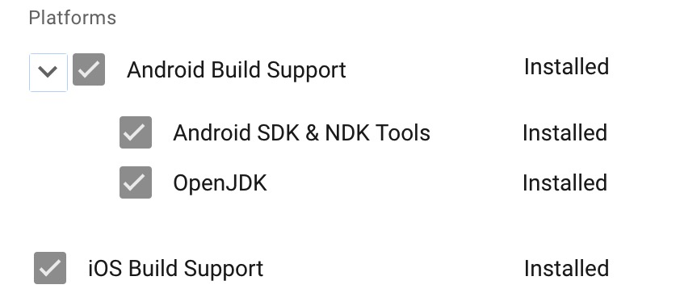
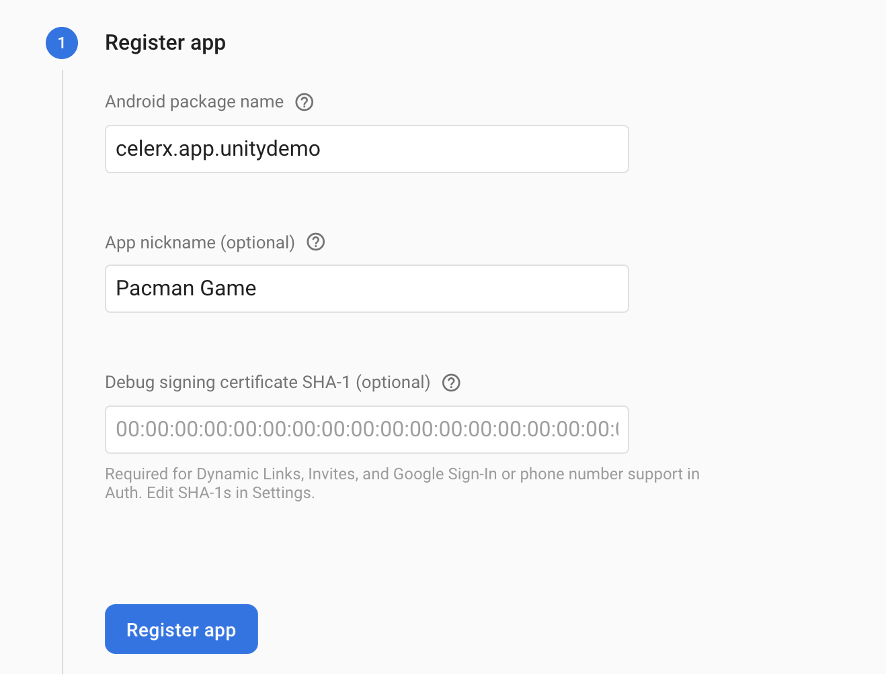
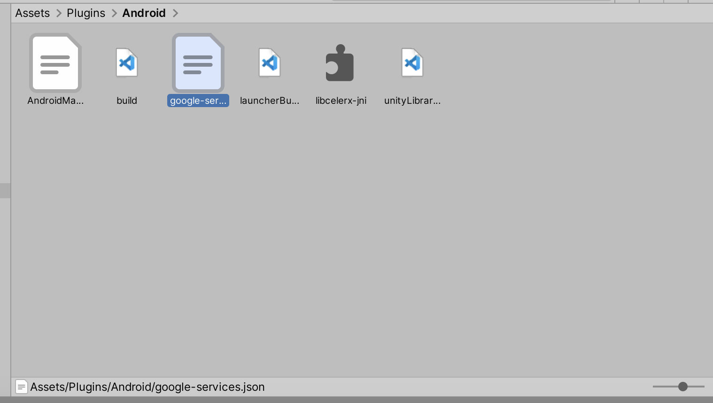
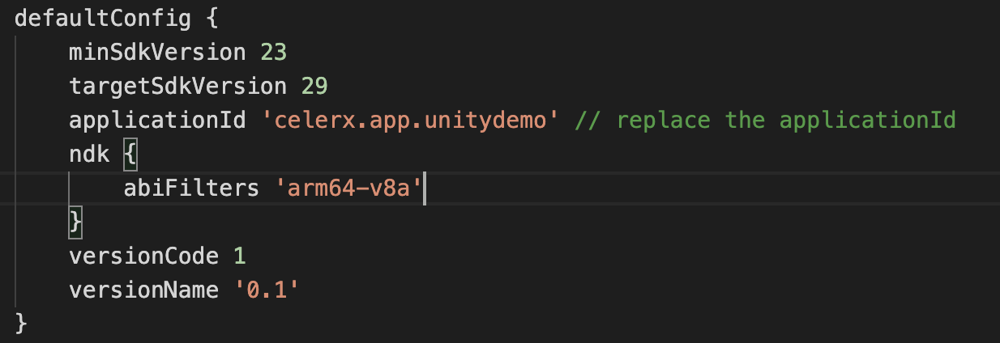
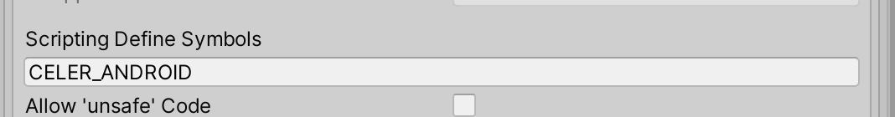
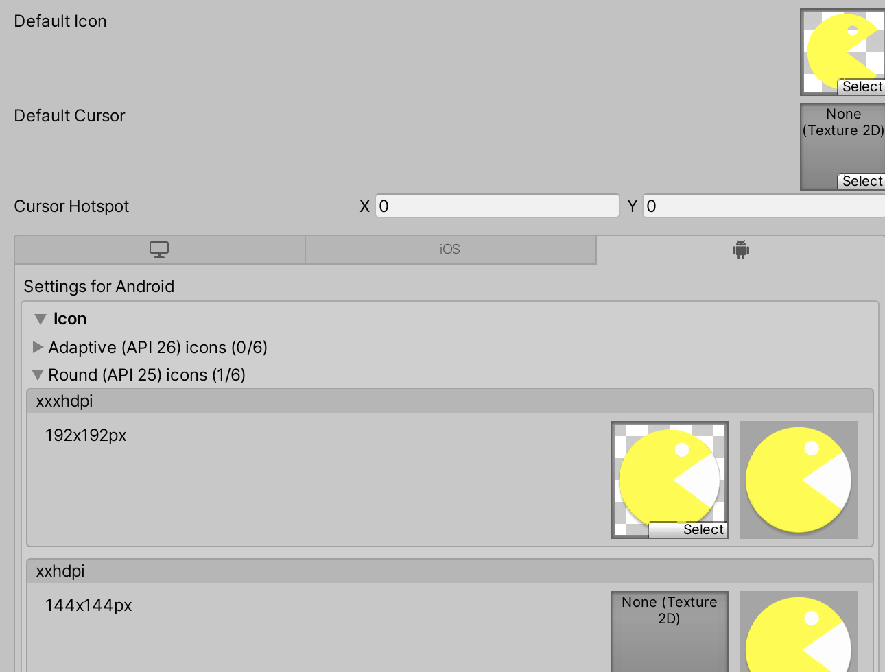
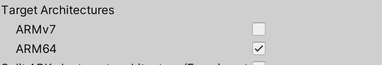
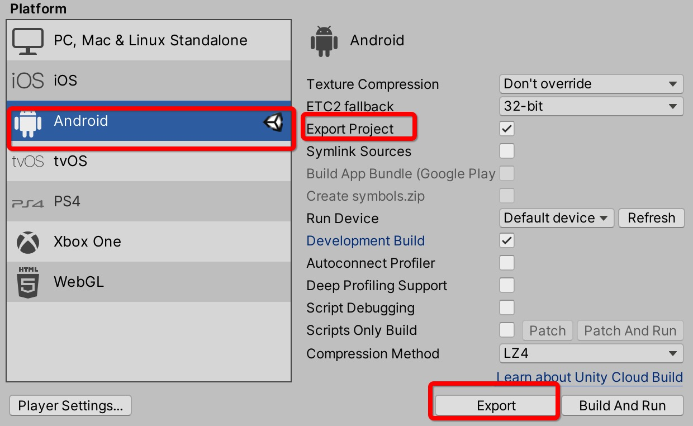

# Unity Integration Doc

This repo is a Unity project that indicates how to integrates CelerX Android SDK in Unity and publish a game app finally.

The example game is Pacman.

## Tools

- Unity Hub
- Visual Studio (IDE)
- Optional: Android Studio

## 1. Install Unity

Unity Version: 2019.3.6f1 (lowest support version is 2019.3.x)

Install Unity Modules In Unity Hub:

Unity Hub -> Install-> Add Modules -> Android Build Support(With Android SDK & NDK and open JDK) -> iOS Build Support




## 2. Firebase Register

The firebase tools such as crashlytics are helped to build the robust app, it's required by SDK inner, please register on the [Firebase Console](https://console.firebase.google.com/).



after register the app step, download the google-services.json file, add this to the folder Assets -> Plugins -> Android. It's will be export to the correct location in the export project or package into the APK file.




## 3. Copy the plugins

<b>The plugin is used to generate Android project without additional Android coding work. </b>

There are two parts:

### 3.1 Copy these Android-related files into Unity assets folder Assets/Plugins/Android
- AndroidManifest.xml `//custom Manifest file, it will replace the default unityLibrary module path src/main/AndroidManifest.xml`
- build.gradle `// custom the project build.gradle, determine the dependencies and plugin versions which Android SDK required`
- launcherBuild.gradle `//custom the launcher module build.gradle`
- unityLibraryBuild.gradle `//custom the unityLibrary module build.gradle`
- libcelerx-jni.so `//provide the native plugin communication Apis`

Android SDK of CelerX is a aar file, it's import by the gradle in unityLibraryBuild.gradle. 

Replace the appliationId value to your corresponding package name in the launcherBuild.gradle that register in the developer portal 

.

version map:

| plugin tags        | Android SDK           | isBeta  |
| ------------- |:-------------:| -----:|
| Latest master    | 0.0.2-beta21 | yes |


### 3.2 Import CelerX Editor Script

<https://github.com/celerx/unity-sdk-android-demo/tree/master/Assets/CelerX>

```
.
├── Assets
|   └── CelerX       - Generate Android project with CelerX SDK
|       └── Editor   - CelerX C# APIs  

```

`CelerXUnityAndroidApp.cs` this script responsible to deal with some compatibility issues such as Android project structs and conflicts.


## 4. Intergrate API

   For Unity scenes, call the `PresentSDKUI()` to launch the CelerX bucket match flow in your start scene. during the match flow, developers can get the game random seed in the `onMatchJoined()`, according to the random seed (sharedRandomSeed in MatchInfo), prepares the game scenes or a new game level,  if player confirmed to start the game, the `onMatchReadyToStart()` will callback,  when the game win, lose or exit, submit the final score in the settle scene which may be a Dialog or a new scene different from gameplay scene.

   <b>CelerX.SetCallback(CelerXMatchListener listener)</b>

`void onMatchJoined(MatchInfo mathInfo);`

This Function will be callback to C sharp after CelerX platform has match player finishing. Developers can get any match information from param `MatchInfo`, such as players information and sharedRandomSeed. Developers must give ui rendering in this callback.

`void onMatchReadyToStart(MatchInfo mathInfo);`

Calling after player clicking ready button and CelerX platform confirmed everything is ready, game can start now.


note that if set the callback block in the finished scence scripts, this will not been triggered, make sure it's keep alive in the lifecycle.

<b> CelerX.PresentSDKUI() </b>
    launch the CelerX UI.

<b> CelerX.Ready() </b>
If game has been loaded and game rendering was finished, developers must call ready function to confirm game can be start, then CelerX will show a ready button in match view for player.

<b> CelerX.SubmitScore(long score) </b>
When the game is over, call this API to submit the final score to the CelerX platform. after a new match flow starts, refresh the level or restart the game scene.


## 5. Export & Publishing 

### 5.1 Scripting Symbols ###

We use a specific symbol to distinguish the platform. add the CELER_ANDROID on Unity Project Settings when you are ready to export or run on the Android project.

location is File -> Build Settings -> Player Settings -> Player -> Other Settings -> Scripting Define Symbols




### 5.2 Add App icon, round icon and Package name  ###

Add the App luancher icon and round icon on Unity, 

Default icon settings in

File -> Build Settings -> Player Settings -> Player -> Default Icon

Round icon settings in 

File -> Build Settings -> Player Settings -> Player -> Settings for Android -> Icon



> Tips: You can convenient get different size icons with tools: https://romannurik.github.io/AndroidAssetStudio/icons-launcher.html


### 5.3 arm64 support ###
    
CelerX only support the 64-bit Architecture devices, change the Unity default architecture to ARM64.

File -> Build Settings -> Player Settings -> Player -> Other Settings -> Target Architectures -> ARM64



### 5.4 Run your Game on Android device

Unity, File -> Build and Run

> Unity has interated gradle plugin for exporting Android apk, just make sure Android Support has beed installed in your Unity Hub.

Optional: For further modification or customization of your Android project, you can export Android project folder with File -> Build settings -> Android -> Export , then import project with [Android Studio](https://developer.android.com/studio?gclid=EAIaIQobChMIyrLd5bvB6AIVCayWCh3__w-8EAAYASAAEgL7afD_BwE&gclsrc=aw.ds)




## Gif


Over!

